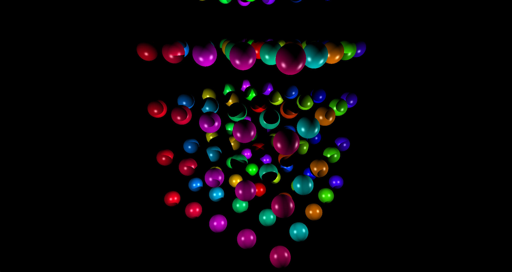
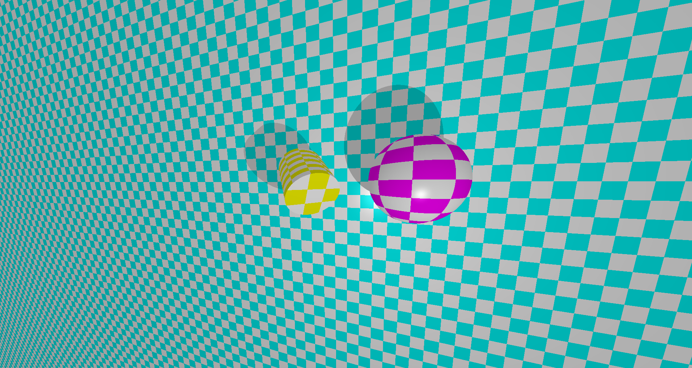
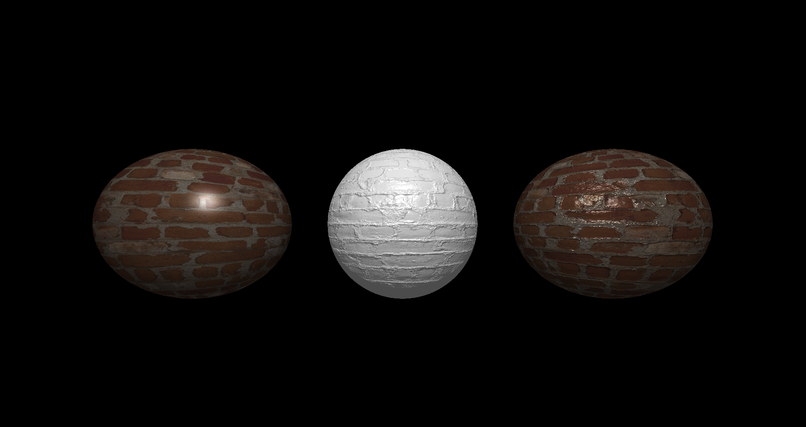
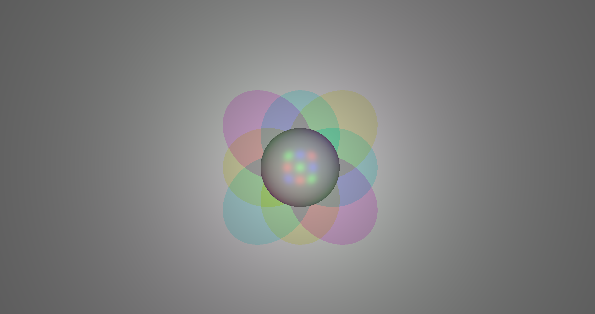

# miniRT 🌟

A ray tracer written in C using MiniLibX

## Showcase

*Basic spheres with lighting and shadows*

*Checkerboard texture mapping*

*Bump mapping for surface detail*

*Multiple colored light sources*

## Features

- **3D Objects**: Spheres, planes, and cylinders
- **Lighting**: Full Phong lighting model with ambient, diffuse, and specular reflection
- **Camera**: Configurable position and orientation
- **Texture Mapping**: UV mapping, bump mapping, and checkerboard patterns
- **Lighting**: Multiple light sources with colored lighting support
- **Scene Files**: Parse `.rt` scene description files

# Setup

clone this repository\
cd into repository\
make

# Running

./miniRT [Filename].rt

# Setup unit testing

cd into root of repository
make setup_test